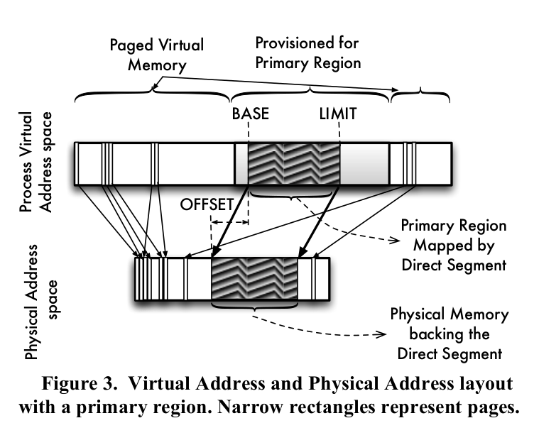

# Efficient Virtual Memory for Big Memory Servers

A. Basu, J. Gandhi, J. Chang, M. D. Hill, and M. M. Swift, ISCA 2013

## Summary

Many "big-memory" server workloads, such as databases, in-memory caches, and graph analytics, pay a high cost for paged VM. TLB misses can account for up to 51% of execution time, while rich features of paged VM is not needed by most applications.

Proposal: Paged VM + Direct Segements, an alternative for huge pages. Mapping part of a process's linear virtual address space with a direct segment, while page mapping the rest of the virtual address space.

## Motivation

Many "big-memory" server workloads pay a high cost for paged VM: they suffer from high TLB misses while not requiring rich features of paged VM.

### Trend

* The amount of physical memory has gone from a few MBs to a few GBs and then a few TBs now.

* The size of TLBs has remained fairly unchanged.

* Many "big-memory" workloads exhibit low access locality.

Higher memory capacity + const TLB + low locality access pattern = more TLB misses.

### Observation of Big-memory Workloads

1. For the majority of their address space, big-memory
workloads do not require swapping, fragmentation
mitigation, or fine-grained protection afforded by current virtual memory implementations. They allocate memory early and have stable memory usage.

2. Big-memory workloads pay a cost of paged VM: substantial performance lost to TLB misses.

3. Many big-memory workloads are long running, sized to match memory capacity, and have one (or a few) primary processses.

## Solution: Paged VM + Direct Segements

__Goal__: enable fast and minimalist address translation through segmentation where possible, while defaulting to conventional page-based virtual memory where needed.

__Proposal__: direct-segment hardware that is used via a software primary region.

### Hardware Support: Direct Segment

__Idea__: Translate a contiguous virtual address range directly onto a contiguous physical address range to eliminate TLB miss. Any virtual address outside the aforementioned virtual address range is mapped through conventional paging.

__Implementation__: Segmentation. BASE, LIMIT, OFFSET registers added per core. Direct segments are aligned to the base page size, so page offset bits are omitted from these registers. A given virtual address for a process is translated either through direct segment or through conventional page-based virtual memory but never both.

### Software Support: Primary Region

1. OS provides a __primary region__ abstraction to let applications specify which portion of their memory does not benefit from paging.

2. OS provisions physical memory for a primary region and maps all or part of the primary region through a direct segment by configuring the direct-segment registers.

Two approaches to manage physical memory:

* Create contiguous physical memory dynamically through periodic memory compaction.

* Use physical memory reservations and set aside memory immediately after system startup.

### Why Not Huge Pages?

1. Large pages and their TLB support do not automatically scale to much larger memories. To support big-memory workloads, the size of large pages and/or size of TLB hierarchy must continue to scale as memory capacity increases.

2. Efficient TLB support for multiple page sizes is difficult. Because the indexing address bits for large pages are unknown until the translation completes, a split-TLB design is typically required where separate sub-TLBs are used for different page sizes. This design can suffer from performance unpredictability while using larger page sizes.

3. Large page sizes are often few and far apart.

## Results from Experiments

For all workloads examined (graph500, memcached, MySQL, NPB:BT, NPB:CG, GUPS), the percentage of time spent on TLB miss handling was reduced to less than 0.5%.

## Questions

* For long-running workloads, can we gradually optimize the virtual-physical mapping by placing important things in the direct segment?

* Can multiple processes use direct segment concurrently? If so, how to manage the direct segment?
