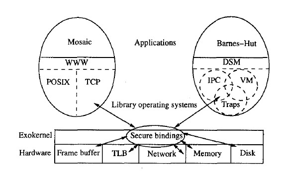

# Exokernel: An Operating System Architecture for Application-Level Resource Management

D. R. Engler, M. F. Kaashoek, and J. O'Toole Jr, SOSP 1995

## Summary

The exokernel operating system architecture seeks to provide application level management of hardware resources. It is designed to separate the resource protection from management, so that application-specific customization could be achieved. Compared with microkernel, it pulles more responsibilities out of the kernel (e.g. abstractions like process and virtual memory) into the application-level libOSes.

## Motivation

### Problems

Traditional operating systems fix the interface and implementation of operating system abstractions such as processes, interprocess communication
and virtual memory. However, fixed high-level abstractions lead to the following problems:

* They hurt application performance because there is no single way to abstract physical resources or to implement an abstraction that is best for all applications.

* They limit the functionality of applications, because they are the only available interface between applications and hardware resources.

* They hide information (like low-level exceptions, timer interrupts, or raw device I/O) from applications, making it difficult or impossible for applications to implement their own resource management abstractions.

### An End-to-End Argument

The "end-to-end" argument in networking applies here as well. Applications know better than operating systems what the goal of their resource management decisions should be and therefore, they should be given as much control as possible over these decisions. That being said, traditional abstractions should be allowed to be implemented entirely at application level.

## Solution: Exokernel + Library OSes

### Provide a Low-level Interface

The exokernel operating system architecture provides application-level management of physical resources by providing a low-level interface. It consists of a thin exokernel layer that multiplexes and exports physical resources securely through a set of low-level primitives. Library operating systems, which use the low-level exokernel interface, implement higher-level abstractions and can define special-purpose implementations that best meet the performance and functionality goals of applications.

### Separate Protection from Management

To provide an interface that is as low-level as possible, a central design principle is to
separate protection from management. exokernel does this by exporting hardware resources. To do it securely, three techniques are used:

1. **Secure Binding**: A protection mechanism that decouples authorization from use. For example, a libOS can request that a certain entry be inserted into TLB. The exokernel can check that the entry is valid. This is the authorization. Later, the CPU can use the TLB without any checking. This is use. The TLB entry can be used multiple times after being authorized only once. In addition to implementing secure bindings, **downloading code** (into the kernel) can be used to improve performance with elimination of kernel crossings. Also, the execution time of downloaded code can be readily bounded and the code can be executed where context switching to the application itself is infeasible (e.g., when only a few microseconds of free processing time is available).

2. **Visible Resource Revocation**: Once resources have been bound to applications, an exokernel should be able to reclaim them and break their secure bindings. This can be done in a either visible or invisible way. In traditional operating systems, resource revocation is invisible. This form of revocation has lower latency than visible revocation since it requires no application involvement. Its disadvantages are that libOSes cannot guide deallocation and have no knowledge that resources are scarce. An exokemel uses visible revocation for most resources. For example, when a CPU is revoked after using up the quantum, a libOS could avoid saving the floating point state or other registers that are not live.

3. **Abort Protocol**: An exokernel must also be able to take resources from libOSes that fail to respond satisfactorily to revocation requests. An exokemel can define a second stage of the revocation protocol in which the revocation request ("please return a memory page") becomes an imperative ("return a page within 50 microseconds").

## Pros and Cons

### Pros

* Fast: applications performance improved by customized resource management, suited for application-specific computing.

* Extensible: just replace libOS on need.

### Cons

* Designing exokernel interfaces is complex.

* Application development is more complicated as there are multiple implementations of OS abstractions.

* Redundant for general-purpose computing: multiple libOSes manage different implementations of OS abstractions.

* For application-specific computing, tradeoff between using exokernel and using specialized macrokernel not clear.
