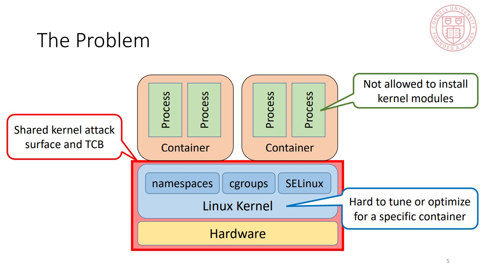
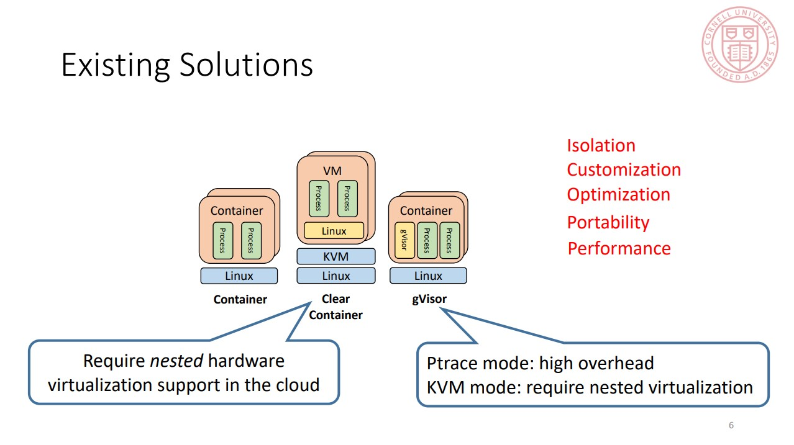
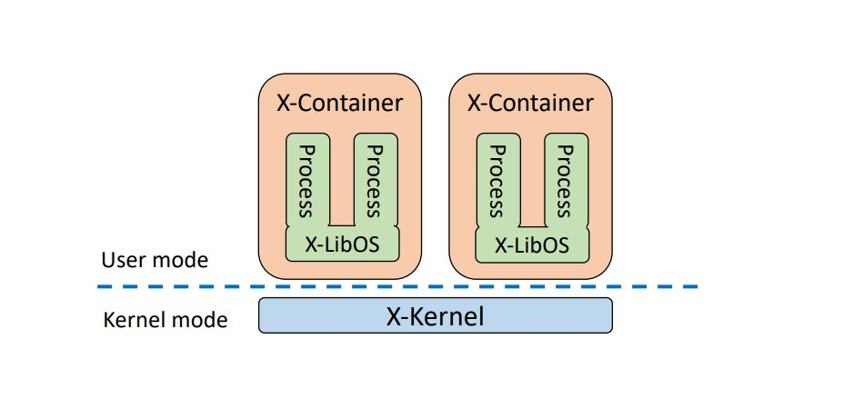
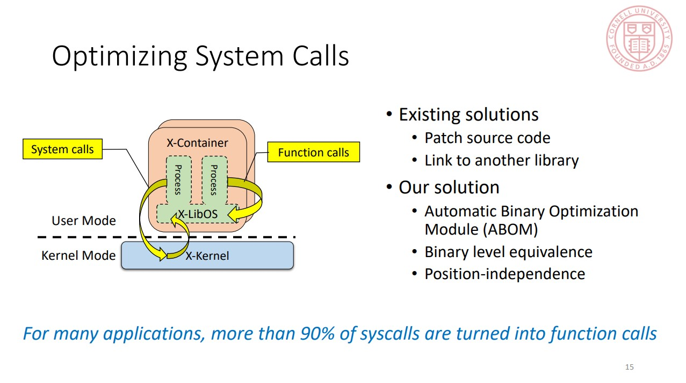

# X-Containers: Breaking Down Barriers to Improve Performance and Isolation of Cloud-Native Containers

Z. Shen, Z. Sun, G. -E. Sela, E. Bagdasaryan, C. Delimitrou, R. V. Renesse, and H. Weatherspoon, ASPLOS 2019

## Motivation

* Trend: Single-Concerned Containers

## Solution: X-Containers

### Exokernel + Container (LibOS integrated with App)

Processes within the same X-Container are mutually trusting, and additionally trust the X-LibOS, and underlying X-Kernel. Inter-container isolation is guarded by the X-Kernel, an exokernel that ensures both a small kernel attack surface (i.e., a small number of well-documented system calls) and a small Trusted Computing Base (TCB).

* Reduced intra-container isolation for better performance __Good Point__

* Improved inter-container isolation

* Processes relying on strong process and kernel isolation, and some widely used security and fault-tolerance mechanisms are no longer
working (e.g. kernel-supported security features such as seccomp cannot work; process-based fault tolerance may not work either as a crashed process might compromise the X-LibOS and the whole application)

### Implementation

* X-LibOS from Linux kernel
  * Binary compatibility
  * Highly customizable

* X-Kernel from Xen
  * Paravirtualiation interface
  * Easier support for concurrent multi-processing in LibOS

* Optimizations

* Limitations
  * Increased memory footprint
  * Memory management overhead (from Xen's memory management mechanism)
  * Spawning speed of new instances (extra time for bootstrapping the whole software stack including the LibOS)
  * GPL license contamination (The Linux kernel uses GPL, which requires that software using GPL-licensed modules must carry a license no less restrictive. This raises concerns for running proprietary software in X-Containers) __Interesting__

## Evaluation

* Syscall perf: Up to 27X of Docker (patched) and 1.6X of Clear-Container

* Macrobenchmark: ~1.25x for NGINX, ~3x for Memcached, ~1.1x for Redis, ~0.7x for Apache (compared with Docker)

* Outperforms Xen-Container (differ from X-Containers: unmodified Xen + unmodified Linux as guest OS), Clear Container, gVisor.
