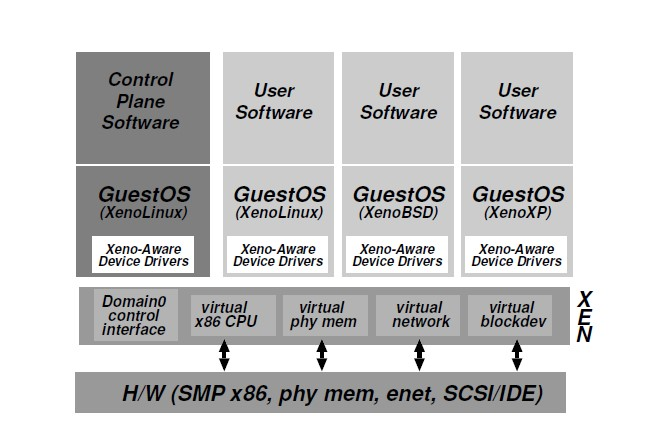
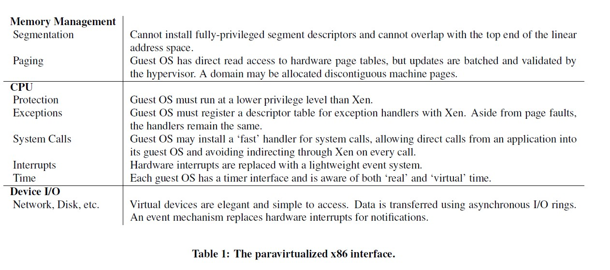

# Xen and the Art of Virtualization

P. Barham, B. Dragovic, K. Fraser, S. Hand, T. Harris, A. Ho, R. Neugebauer, I. Pratt, and A. Warfield, SOSP 2003

## Summary

The paper presents Xen, an x86 virtual machine monitor that allows hosting up to 100 virtual machine instances simultaneously on a modern server. It is achieved by introducing a virtual machine abstraction that is similar but not identical to the underlying hardware, an approach known as "paravirtualization".

## Motivations

### Goal

Build a system to host multiple (100 and even more) applications and servers on a shared machine.

### Problems

The simplest way is to deploy one or more hosts running a standard operating system and then to allow users to install files and start processes. However, this approach suffers from lack of performance isolation and complexity of system administration.

On the other hand, one can utilize full virtualization that allows unmodified operating systems to be hosted. However, it also has a number of drawbacks. First, it lacks architectural support from the x86 architecture, which leads to expensive performance cost. Second, there are situations in which it is desirable for the hosted operating systems to see real as well as virtual resources.

## Solution: Paravirtualization

Xen exploits paravirtualization, which sacrifices the ability to run unmodified operating systems for additional performance, but still suppots unmodified application binaries. It introduces a virtual machine abstraction that is similar but not identical to the underlying hardware. It virtualizes the hardware page table of x86, where Guest OSes are responsible for allocating and managing the hardware page tables, with minimal involvement from Xen to ensure safety and isolation. It utilizes the Ring 1 of x86, forcing guest OS to run in Ring 1 with a lower privilege level than Xen.

## Evaluation

The authors modified a version of Linux to run on Xen, and reported the lines of modification, which is relatively small compared to the full code base.

Modified Linux on top of Xen was compared with native Linux, VMware workstation, User-mode Linux on relative performance in a range of microbenchmarks and system-wide tests. It is showed that the performance overhead of Xen is rather small.

## Comments

Although the almost negligible performance overhead is impressive, the adoption of paravirtualization still suffers from the need to modify OS kernel. However, problems such as maintaining multiple different versions of an OS can add extra complexity to Xen.
